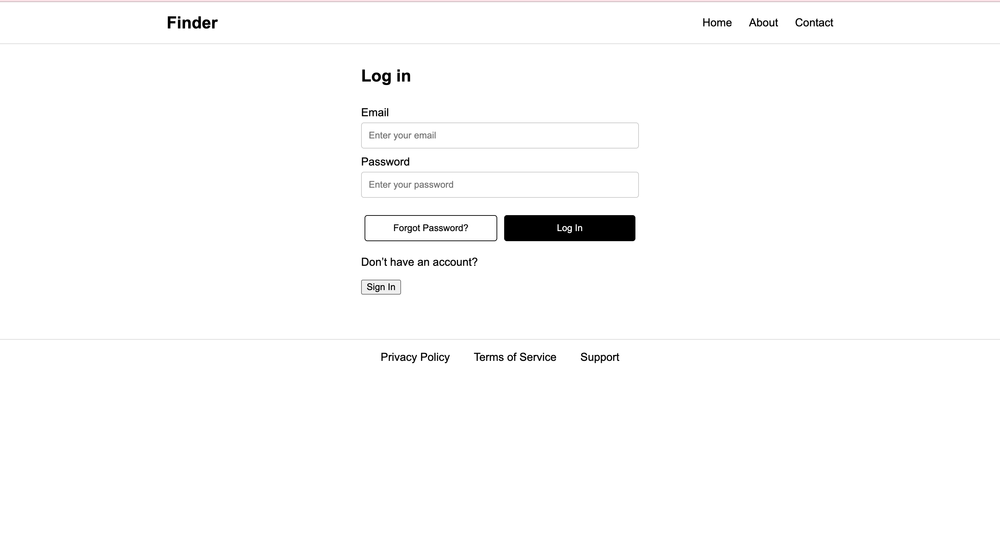
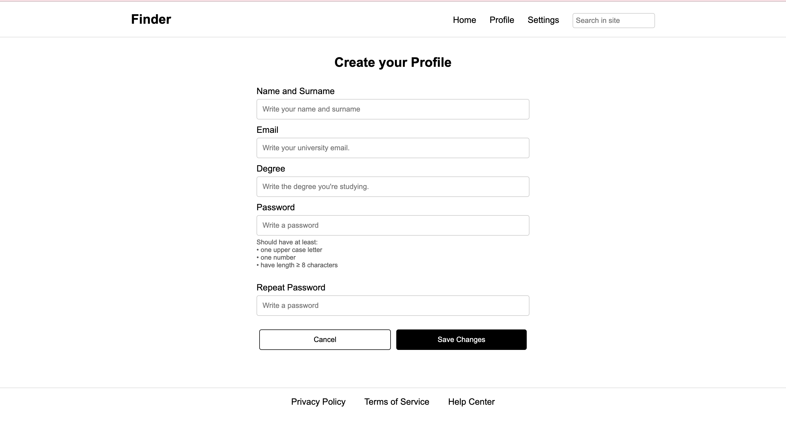
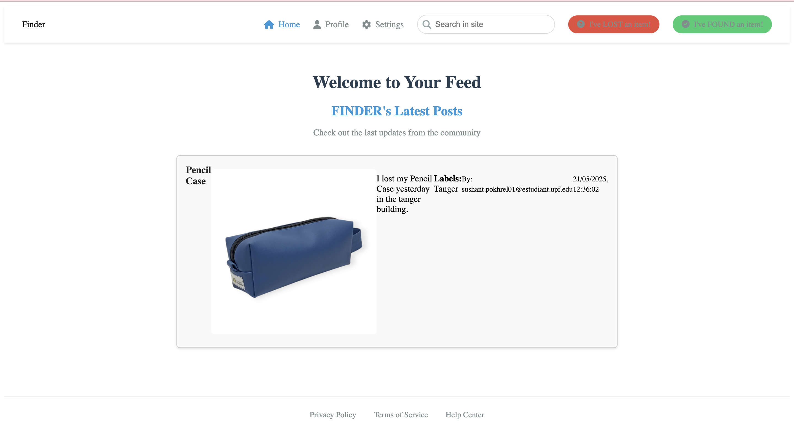
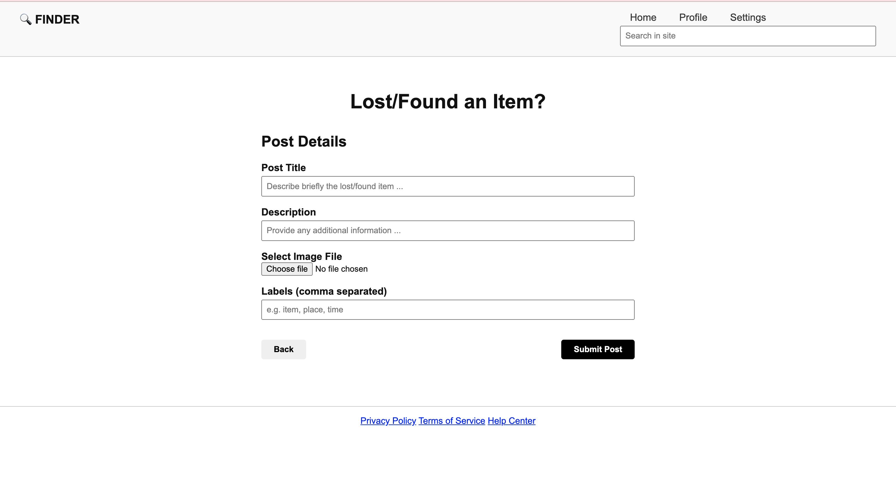

# FINDER

An App aimed at to the university students to help to recuparate their lost items in the university. 

---

## Table of Contents

* [About the Project](#about-the-project)
    * [Members](#members)
* [Features](#features)
* [Technologies Used](#technologies-used)
* [Getting Started](#getting-started)
    * [Prerequisites](#prerequisites)
    * [Installation](#installation)
* [Usage](#usage)

---

## About the Project

An app aimed at university students where they can create a community and post there the objects that they have lost in the university and other users can participate in the post and help them to find their lost items, further universities could also participate and add post where they post the lost items of the students. 

The objective of our app is to help the users find their lost items in the university. Finder aims to improve the chances of item recovery while fostering a sense of community and mutual assistance among students and faculty.

---

## Members
This is our Project for the course Software engineering(course 2025). We are Group 12 formed by:
 - Alex Roig 
 - Claudia Hereter
 - Jana Baguer
 - Oscar Salueña
 - Paula Navarro
 - Sushant Pokhrel

## Features

Features Available at the moment. 

* Log In: The user is able to do the log in the app and able to acess to the main feed.
* Sign In: The user is able to create a account to be able to log in.
* Main Feed: The user is able to look what the other user have posted.
* Post Creation: The user is able to create a post for a found/lost item. 

---

## Technologies Used

These are the technologies that we have used for our project.

* **Frontend:**
    * `HTML`
    * `CSS`
    * `JavaScript`
* **Backend:**
    * 
* **Database:**
    * `Firebase`
* **Other Tools:**
    * `Git`
    * `Github`

---

## Getting Started

Instructions on how to set up and run your project locally.

### Prerequisites

Since this a web app you need to have a web browser. 

### Installation

In this google document you can find the instruction to try the app.
https://shorturl.at/3FoLa

---

## Usage

* **Log In:** The interface for the Log In.  
  
  
* **Sign Up:** The interface for the Sign Up.  
  
  
* **Main Feed:** The interface for the Main Feed.  
  
  
* **Post Creation:** The interface for the Post Creation.  
  

---

